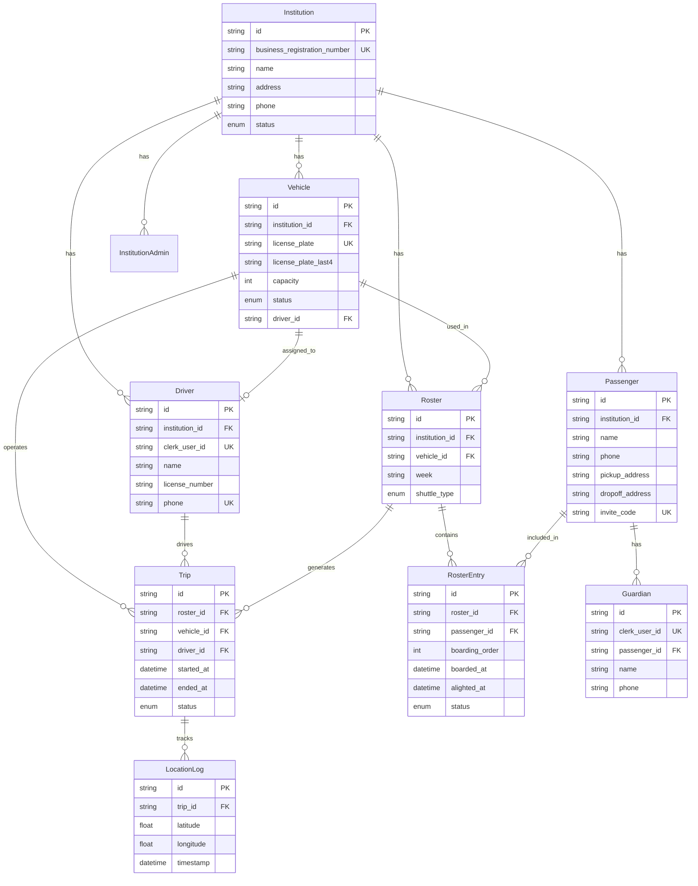

# PickUp - 기술 아키텍처

**프로젝트**: PickUp
**버전**: 1.0 (MVP)
**최종 수정**: 2025-11-09

---

## 📐 시스템 아키텍처 개요

PickUp은 **Monorepo 기반의 풀스택 TypeScript 애플리케이션**으로, 관리자 포털(웹)과 기사/승객 모바일 앱으로 구성됩니다.

### 고수준 아키텍처

```
┌─────────────────────────────────────────────────────────────┐
│                     Client Layer                             │
├─────────────────────────────────────────────────────────────┤
│  Admin Portal (Web)  │  Driver App (Mobile) │ Passenger App │
│   Next.js 16+        │   React Native       │  React Native │
│   shadcn/ui          │   Expo               │   Expo        │
└──────────────┬───────────────────┬───────────────────┬───────┘
               │                   │                   │
               └───────────────────┼───────────────────┘
                                   │
                    ┌──────────────┴──────────────┐
                    │   API Layer (Next.js)       │
                    │   Server Actions + Routes   │
                    └──────────────┬──────────────┘
                                   │
               ┌───────────────────┼───────────────────┐
               │                   │                   │
        ┌──────▼──────┐    ┌──────▼──────┐    ┌──────▼──────┐
        │   Prisma    │    │    Redis    │    │    Clerk    │
        │     ORM     │    │   (Cache)   │    │    (Auth)   │
        └──────┬──────┘    └─────────────┘    └─────────────┘
               │
        ┌──────▼──────┐
        │ PostgreSQL  │
        │  (Prod DB)  │
        └─────────────┘
```

---

## 🏗️ 도메인 경계 (DDD Bounded Contexts)

PickUp은 Domain-Driven Design(DDD)을 따르며, 5개의 Bounded Context로 구성됩니다.

### 1. Institution Context (기관 관리)

**책임**:
- 기관(학원/요양원/데이케어) 정보 관리
- 사업자등록번호 기반 신원 확인
- 기관 관리자 계정 관리
- 구독 상태 관리

**핵심 엔티티**:
- `Institution`: 기관
- `InstitutionAdmin`: 기관 관리자

**API**:
- `POST /api/institutions` - 기관 등록
- `GET /api/institutions` - 기관 목록
- `PUT /api/institutions/[id]` - 기관 수정
- `POST /api/institutions/[id]/admins` - 관리자 초대

---

### 2. Fleet Context (차량 및 기사 관리)

**책임**:
- 차량 정보 관리 (차량번호 뒤 4자리 식별)
- 기사 정보 관리 및 Clerk 계정 연동
- 차량-기사 1:1 매칭
- 차량 상태 관리 (운행 가능/정비 중/폐차)

**핵심 엔티티**:
- `Vehicle`: 차량
- `Driver`: 기사

**API**:
- `POST /api/vehicles` - 차량 등록
- `POST /api/drivers` - 기사 등록
- `PUT /api/vehicles/[id]/assign-driver` - 기사 배정

---

### 3. Roster Context (승객 명단 관리)

**책임**:
- 승객 정보 관리
- 주간 단위 명단(Roster) 생성 및 관리
- 엑셀 업로드를 통한 대량 등록
- 셔틀 타입 구분 (오전/저녁/임시)

**핵심 엔티티**:
- `Passenger`: 승객
- `Guardian`: 보호자 (승객 앱 사용자)
- `Roster`: 주간 명단
- `RosterEntry`: 명단 항목 (승객 + 승하차 기록)

**API**:
- `POST /api/passengers` - 승객 등록
- `POST /api/passengers/upload` - 엑셀 업로드
- `POST /api/rosters` - 명단 생성
- `POST /api/rosters/[id]/copy` - 명단 복사

---

### 4. Route Context (경로 및 운행 관리)

**책임**:
- 운행(Trip) 시작/종료 관리
- 실시간 GPS 위치 수집 및 저장
- ETA 계산 (MVP: 직선거리, Stage 2: AI 최적화)
- 운행 이력 기록

**핵심 엔티티**:
- `Trip`: 운행
- `LocationLog`: GPS 위치 로그

**API**:
- `POST /api/trips/start` - 운행 시작
- `POST /api/trips/[id]/location` - GPS 위치 업데이트
- `POST /api/trips/[id]/end` - 운행 종료
- `GET /api/trips/[id]/location` - 최신 위치 조회

---

### 5. User Context (인증 및 권한)

**책임**:
- Clerk 기반 인증 관리
- 역할별 권한 관리 (기관 관리자, 기사, 보호자)
- 초대 코드 기반 승객-보호자 연결

**핵심 엔티티**:
- Clerk User (외부 서비스)
- Metadata: `institutionId`, `role`, `driverId`, `passengerId`

**API**:
- Clerk Webhooks 활용
- `POST /api/passengers/link` - 초대 코드로 보호자 연결

---

## 🗄️ 데이터 아키텍처

### 데이터베이스 전략

| 저장소 | 용도 | 기술 |
|--------|------|------|
| **PostgreSQL** | 메인 DB (영구 저장) | Prisma ORM |
| **Redis** | 실시간 위치 캐시 (TTL 1시간) | ioredis |
| **Clerk** | 인증 정보 저장 | SaaS |

### 데이터 흐름

#### 1. 실시간 GPS 위치 추적

```
기사 앱 (GPS 수집)
    ↓ 10초마다
POST /api/trips/[tripId]/location
    ↓
Redis (최신 위치 저장, TTL 1시간)
    ↓ 동시에
PostgreSQL (LocationLog 배치 삽입, 1분마다)

승객 앱 / 관리자 포털
    ↓ 3초마다 polling
GET /api/trips/[tripId]/location
    ↓
Redis에서 조회 (빠른 응답)
```

#### 2. 승하차 알림

```
기사 앱 (체크인 클릭)
    ↓
POST /api/roster-entries/[id]/board
    ↓
PostgreSQL (boardedAt 업데이트)
    ↓ 트리거
FCM 푸시 알림 발송 (보호자 앱)
```

---

## 🔧 기술 스택 상세

### 프론트엔드

#### 관리자 포털 (Web)
```json
{
  "framework": "Next.js 16+ (App Router)",
  "language": "TypeScript",
  "styling": "Tailwind CSS",
  "ui-library": "shadcn/ui",
  "state-management": "React Server Components + Server Actions",
  "forms": "react-hook-form + Zod",
  "maps": "react-kakao-maps-sdk",
  "auth": "@clerk/nextjs"
}
```

#### 모바일 앱 (Driver + Passenger)
```json
{
  "framework": "React Native (Expo)",
  "language": "TypeScript",
  "styling": "NativeWind (Tailwind for RN)",
  "navigation": "expo-router",
  "maps": "react-native-maps",
  "location": "expo-location",
  "notifications": "expo-notifications (FCM)",
  "auth": "@clerk/clerk-expo"
}
```

### 백엔드

```json
{
  "runtime": "Node.js 20+",
  "framework": "Next.js API Routes + Server Actions",
  "orm": "Prisma",
  "database": "PostgreSQL (prod), SQLite (dev)",
  "cache": "Redis (ioredis)",
  "auth": "Clerk",
  "push-notifications": "Firebase Cloud Messaging (FCM)",
  "file-parsing": "xlsx (엑셀 업로드)"
}
```

### 인프라

```json
{
  "hosting-web": "Vercel",
  "hosting-mobile": "EAS Build (Expo Application Services)",
  "database": "Vercel Postgres / Supabase",
  "redis": "Upstash Redis (serverless)",
  "storage": "Vercel Blob (영수증 이미지, Stage 2)",
  "monitoring": "Vercel Analytics + Sentry"
}
```

---

## 📊 데이터베이스 ERD

### 핵심 엔티티 관계도



---

## 🔐 인증 및 권한 (Clerk)

### 역할 기반 접근 제어 (RBAC)

PickUp은 **Clerk의 Metadata 기반 역할 관리**를 사용합니다.

#### 역할 정의

| 역할 | 대상 | 권한 |
|------|------|------|
| **platform_admin** | PickUp 운영팀 | 모든 기관 관리, 시스템 설정 |
| **institution_admin** | 기관 관리자 | 자기 기관의 차량/기사/승객/명단 관리 |
| **driver** | 기사 | 자기 차량의 운행 시작/종료, 승객 체크인 |
| **guardian** | 보호자 | 자기 자녀/부모의 운행 정보 조회, 알림 수신 |

#### Clerk Metadata 구조

```typescript
// 기관 관리자
{
  publicMetadata: {
    role: "institution_admin",
    institutionId: "inst_123",
    institutionAdminId: "admin_456"
  }
}

// 기사
{
  publicMetadata: {
    role: "driver",
    institutionId: "inst_123",
    driverId: "driver_789"
  }
}

// 보호자
{
  publicMetadata: {
    role: "guardian",
    passengerId: "passenger_101"
  }
}
```

### 권한 체크 예시 (Middleware)

```typescript
// middleware.ts
import { authMiddleware } from "@clerk/nextjs";

export default authMiddleware({
  publicRoutes: ["/", "/api/webhooks/clerk"],

  // 기관 관리자만 접근 가능
  beforeAuth: (req) => {
    if (req.url.includes("/dashboard/")) {
      const { userId, sessionClaims } = getAuth(req);
      const role = sessionClaims?.metadata?.role;

      if (role !== "institution_admin") {
        return new Response("Unauthorized", { status: 403 });
      }
    }
  }
});
```

---

## 🚀 API 설계 원칙

### RESTful API (Next.js App Router)

#### 1. Server Actions (Form 제출, 데이터 변경)

```typescript
// app/actions/vehicles.ts
'use server'

export async function createVehicle(formData: FormData) {
  const { userId } = auth();
  const institutionId = getUserInstitutionId(userId);

  const data = {
    licensePlate: formData.get('licensePlate'),
    capacity: parseInt(formData.get('capacity')),
    institutionId
  };

  const vehicle = await prisma.vehicle.create({ data });
  revalidatePath('/dashboard/vehicles');

  return { success: true, vehicle };
}
```

#### 2. API Routes (외부 앱, Webhooks)

```typescript
// app/api/trips/[tripId]/location/route.ts
export async function POST(
  req: Request,
  { params }: { params: { tripId: string } }
) {
  const { latitude, longitude } = await req.json();

  // Redis에 최신 위치 저장 (TTL 1시간)
  await redis.set(
    `trip:${params.tripId}:location`,
    JSON.stringify({ lat: latitude, lng: longitude, timestamp: Date.now() }),
    'EX', 3600
  );

  // PostgreSQL에 비동기 배치 삽입 (별도 큐)
  await locationQueue.add({ tripId: params.tripId, latitude, longitude });

  return Response.json({ success: true });
}

export async function GET(
  req: Request,
  { params }: { params: { tripId: string } }
) {
  const location = await redis.get(`trip:${params.tripId}:location`);
  return Response.json(JSON.parse(location || '{}'));
}
```

---

## 📡 실시간 데이터 전송 전략

### Polling vs WebSocket

MVP에서는 **Polling** 방식을 사용합니다 (구현 단순성, Vercel 호환성).

| 방식 | 장점 | 단점 | 채택 여부 |
|------|------|------|-----------|
| **Polling** | 구현 간단, Vercel 호환 | 불필요한 요청 증가 | ✅ MVP |
| **WebSocket** | 실시간성 높음, 효율적 | Vercel 제약, 복잡도 증가 | ❌ Stage 2 검토 |
| **Server-Sent Events** | 단방향 실시간, 중간 복잡도 | 브라우저 호환성 | ⚠️ Stage 2 대안 |

#### Polling 구현 (승객 앱)

```typescript
// apps/passenger-app/services/trip-poller.ts
export function useTripLocation(tripId: string) {
  const [location, setLocation] = useState<Location | null>(null);

  useEffect(() => {
    const interval = setInterval(async () => {
      const res = await fetch(`/api/trips/${tripId}/location`);
      const data = await res.json();
      setLocation(data);
    }, 3000); // 3초마다

    return () => clearInterval(interval);
  }, [tripId]);

  return location;
}
```

---

## 📦 프로젝트 구조 (Monorepo)

```
pickup/
├── apps/
│   ├── admin-portal/          # Next.js 관리자 포털
│   │   ├── app/
│   │   │   ├── (auth)/
│   │   │   ├── (dashboard)/
│   │   │   ├── actions/       # Server Actions
│   │   │   └── api/           # API Routes
│   │   ├── components/
│   │   ├── lib/
│   │   └── prisma/            # Prisma 스키마
│   ├── driver-app/            # React Native 기사 앱
│   │   ├── app/
│   │   ├── components/
│   │   └── services/
│   └── passenger-app/         # React Native 승객 앱
│       ├── app/
│       ├── components/
│       └── services/
├── packages/                  # 공유 라이브러리 (선택)
│   ├── db/                    # Prisma client
│   └── types/                 # 공통 타입
├── docs/                      # 문서
│   ├── epics/
│   ├── architecture.md
│   └── api-spec.md
└── CLAUDE.md                  # 프로젝트 개요
```

---

## 🔄 CI/CD 파이프라인

### 배포 플로우

```
Git Push (main branch)
    ↓
GitHub Actions
    ├─→ Admin Portal
    │   ├── TypeScript 체크
    │   ├── ESLint
    │   ├── Prisma 마이그레이션 검증
    │   └── Vercel 배포
    │
    ├─→ Driver App
    │   ├── TypeScript 체크
    │   ├── EAS Build (iOS + Android)
    │   └── TestFlight / Internal Testing 배포
    │
    └─→ Passenger App
        ├── TypeScript 체크
        ├── EAS Build (iOS + Android)
        └── TestFlight / Internal Testing 배포
```

---

## 🧪 테스트 전략

### 테스트 피라미드

```
         /\
        /E2E\         (5%)  Playwright (웹), Detox (모바일)
       /------\
      /  통합  \       (15%) API 테스트, DB 통합 테스트
     /----------\
    /   단위     \     (80%) Jest + Testing Library
   /--------------\
```

#### 1. 단위 테스트 (Jest)
```typescript
// __tests__/actions/vehicles.test.ts
describe('createVehicle', () => {
  it('should create vehicle with valid data', async () => {
    const vehicle = await createVehicle({
      licensePlate: '12가3456',
      capacity: 9,
      institutionId: 'inst_123'
    });

    expect(vehicle.licensePlateLast4).toBe('3456');
  });
});
```

#### 2. 통합 테스트 (API)
```typescript
// __tests__/api/trips.test.ts
describe('POST /api/trips/start', () => {
  it('should start trip and send push notification', async () => {
    const res = await fetch('/api/trips/start', {
      method: 'POST',
      body: JSON.stringify({ rosterId: 'roster_123' })
    });

    expect(res.status).toBe(200);
    expect(pushNotificationMock).toHaveBeenCalled();
  });
});
```

#### 3. E2E 테스트 (Playwright - 웹)
```typescript
// e2e/admin-portal.spec.ts
test('관리자가 차량을 등록하고 기사를 배정한다', async ({ page }) => {
  await page.goto('/dashboard/vehicles/new');
  await page.fill('[name="licensePlate"]', '12가3456');
  await page.click('button[type="submit"]');

  await expect(page.locator('text=12가3456')).toBeVisible();
});
```

---

## 🔒 보안 고려사항

### 1. 인증 및 권한
- ✅ Clerk 기반 인증 (JWT)
- ✅ Metadata 기반 역할 검증
- ✅ API Route 권한 체크 (Middleware)

### 2. 데이터 보호
- ✅ 개인정보 암호화 (Prisma 레벨)
- ✅ HTTPS 강제 (Vercel 자동)
- ✅ Rate Limiting (Vercel Edge)

### 3. 취약점 대응
- ✅ SQL Injection 방어 (Prisma ORM)
- ✅ XSS 방어 (React 자동 이스케이핑)
- ✅ CSRF 방어 (Next.js Server Actions)

---

## 📈 성능 최적화

### 1. 데이터베이스
- ✅ 인덱스 설계 (Prisma @@index)
  - `LocationLog`: `(tripId, timestamp)`
  - `RosterEntry`: `(rosterId, passengerId)`
- ✅ Connection Pooling (Prisma 내장)

### 2. 캐싱
- ✅ Redis: 실시간 위치 (TTL 1시간)
- ✅ Next.js: React Server Components 자동 캐싱

### 3. 모바일 최적화
- ✅ 이미지 최적화 (Expo Image)
- ✅ Background Task (GPS 수집)
- ✅ Offline 지원 (AsyncStorage)

---

## 🚀 Stage 2 확장 계획

### 추가 아키텍처 컴포넌트

1. **AI VRP 엔진**
   - Google OR-Tools Python 서비스 (별도 컨테이너)
   - gRPC 또는 REST API 통신

2. **Message Queue**
   - BullMQ + Redis (비동기 작업)
   - 용도: 이메일 발송, OCR 처리, 경로 최적화

3. **Object Storage**
   - Vercel Blob (영수증 이미지)

4. **BI Dashboard**
   - Metabase 또는 Superset (별도 서비스)

---

**작성자**: John (Product Manager)
**최종 수정**: 2025-11-09
**문서 버전**: 1.0
